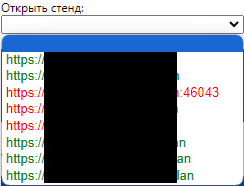
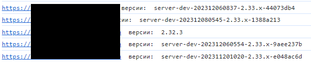

# QA-plugin

Этот "плагин" или расширение для браузера был создан мной как личный проект с целью повышения эффективности работы тестировщиков внутри компании ИТ-Экспертиза.

## Инструкция по установке

1. Клонировать репозиторий проекта на своё рабочее место
1. В браузере Google Chrome открыть настройки расширений (plugins)

    ```link
    chrome://extensions/
    ```

1. В правом верхнем углу страницы настроек включить `Режим разработчика`
1. Нажать кнопку `Загрузить распакованное расширение` и указать в качестве целевого каталога локальный репозиторий QA-plugin
1. Использовать функцию закрепления расширения (pin), чтобы появилась кнопка быстрого доступа к меню плагина справа от поля для поиска и ввода адресной строки браузера
1. Найти ярлык для браузера Google Chrome, вызвать контекстное меню `Свойства` и дописать с сохранением в поле `Объект` ключ запуска по примеру

    ```text
    "C:\Program Files\Google\Chrome\Application\chrome.exe" --ignore-certificate-errors
    ```

1. Закрепить этот ярлык и запускать браузер при работе над проектами из него

## Функционал и особенности

* Поддержка множества проектов, на данный момент трёх: САКУРА, Умный мониторинг, ПУСК
* Плагин помнит выбор проекта пользователя и в следующий запуск браузера будет готов к работе
* Настройка проектных опций посредством конфигурационного файла config.js с синтаксисом напоминающим json
* Мониторинг состояния и версий серверных стендов: зеленые - онлайн, красные - офлайн

  

* Версии доступных стендов можно увидеть из консольного вывода расширения (переход через контекстное меню `Просмотреть код`):

  

* Чтобы открыть панель управления любого стенда - достаточно выбрать его в выпадающем списке
* При входе на стенд происходит автоматическая авторизация с использованием одной из учётных записей, которые заполняются из конфигурационного файла, пример:

    ```json
    Credentials:{
		test:{login:"TestProject", password:"12345678"}
    }
    ```

* Также плагин имеет быстрые кнопки осуществляющие
  * переход на страницу выбранного проекта в ТМС
  * копирование в буфер обмена отформатированной для вставки в руководство пользователя, тест-кейс либо баг-репорт ссылки на страницу по её хлебным крошкам, пример:

    ```text
    cтраница [Справочники → Программное обеспечение → Редактирование группы: Антивирусы|https://адрес_сервера/handbooks/software/group/495]
    ```

  * макросы для Jira: создание баг-репорта в один клик, либо лишь вставка шаблона на заранее открытую страницу заведения тикета

## Известные проблемы текущей версии

* Не все параметры из конфига принимаются приложениям - часть является заглушкой
* Мониторинг стендов реализован лишь для проекта САКУРА
* Макрос создания баг-репорта в один клик может зависнуть
* Копирование страницы может не сработать, либо может скопировать не текущую страницу, а прошлую
